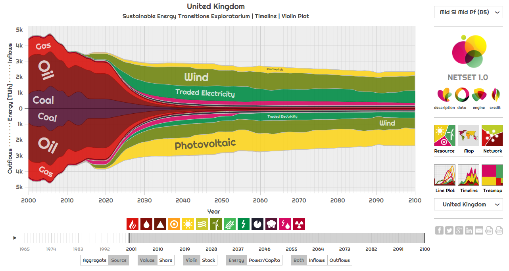

[  Networked Sustainable Energy Transitions Exploratorium](http://netset.csaladen.es/)
===
  

Investigating how society needs to be aware of EROEI (energy return on energy invested) dynamics of the different energy sources as it transitions away from fossil fuels. We map the energy trade dynamics of countries throughout their fossil-renewable energy transitions. This is an extension of the [Sustainable Energy Transitions](http://set.csaladen.es) model.  A project by [Dénes Csala](http://www.csaladen.es/) at [Lancaster University](http://lancaster.ac.uk) and [Sgouris Sgouridis](http://www.ssgouridis.org/) at [Masdar Institute of Science and Technology](http://www.masdar.ac.ae/).

__This is an interactive global visualization and exploration interface (_exploratorium_)__.

# App
Try: http://netset.csaladen.es

# Articles
1. Sgouridis, Kaya, Csala, [Switching Economics for Physics and the Carbon Price Inflation: Problems in Integrated Assessment Models and their Implications](http://arxiv.org/abs/1603.06196), 2016, preprint on arXiv
2. Sgouridis, Csala, Bardi, [The Sower's way. Quantifying the Narrowing Net-Energy Pathways to a Global Energy Transition](http://iopscience.iop.org/article/10.1088/1748-9326/11/9/094009), 2016, Env. Res. Let.
3. Csala, [A data-driven dynamic net-energy analysis of global and national sustainable energy transition paths](https://www.academia.edu/27857565/A_data-driven_dynamic_net-energy_analysis_of_global_and_national_sustainable_energy_transition_paths), 2016, PhD thesis, Masdar Institute, MIT

# Cite
Please use articles (1), (2) and (3) to refer to this work. Contact the authors ([Dénes](d.csala@lancaster.ac.ae), [Sgouris](ssgouridis@masdar.ac.ae)) if you would like to use the data presented on this website more extensively or you would like to collaborate on the project.

# Description
Coming soon.

# Credit
Dénes Csala, 2017  
http://csaladen.es
